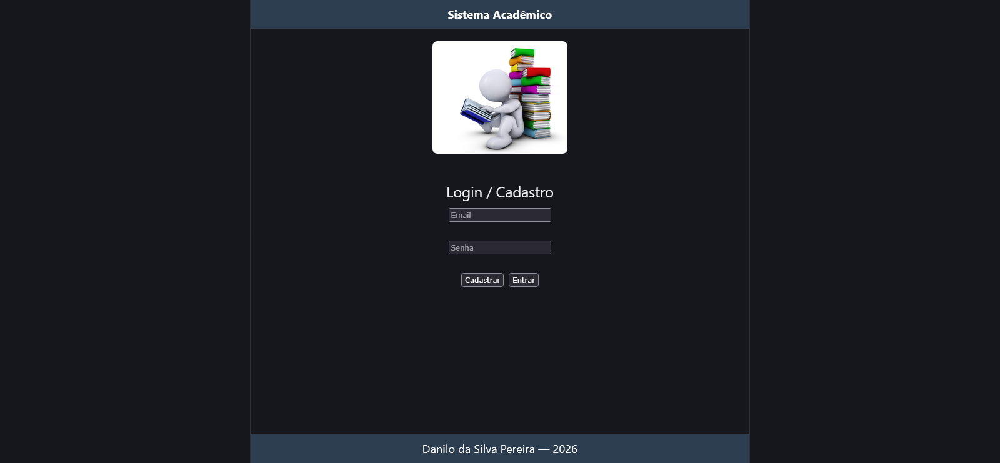
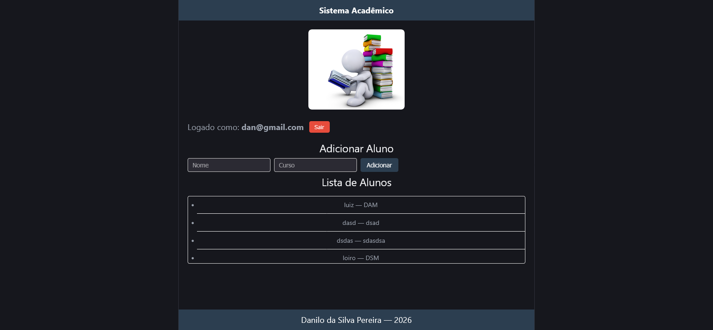
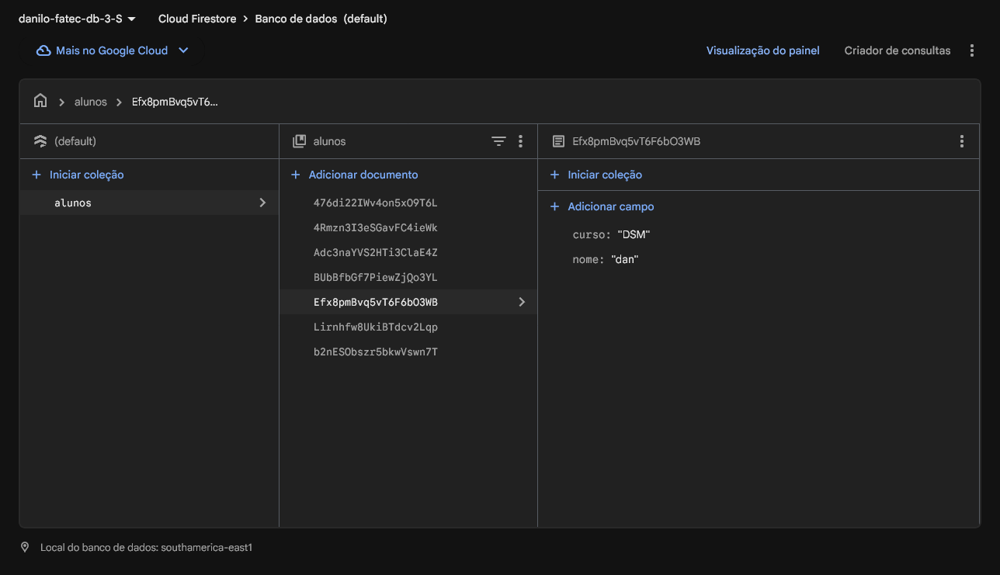

# 📚 Lista de Alunos — React + Vite + Firebase

Atividade acadêmica desenvolvida com **React + Vite + Firebase**, aplicando os conceitos fundamentais da biblioteca e integração com banco de dados NoSQL.

---

## 👨‍💻 Autor

**Danilo** — 2025

---

## 📋 Sobre o Projeto

Aplicação web para gerenciamento de uma lista de alunos, desenvolvida como atividade avaliativa da FATEC. O projeto explora os principais conceitos do React de forma prática e objetiva, com autenticação de usuários e persistência de dados no **Firebase Firestore**.

---

## 🖼️ Prints do Sistema

### Tela de Login e Cadastro


### Tela Principal — Listagem de Alunos


### Dados salvos no Firestore


---

## ✅ Requisitos Implementados — Desenvolvimento Web III

| Requisito | Descrição | Pontos |
|-----------|-----------|--------|
| **StatusBar** | Componente que exibe o título do sistema via `props` | 1,5 pts |
| **Footer** | Rodapé com nome do autor e ano | 1,0 pt |
| **Imagem** | Exibição de imagem relacionada à educação | 1,0 pt |
| **useState** | Estado para armazenar lista de alunos (nome e curso) | 2,0 pts |
| **map** | Listagem dinâmica dos alunos na tela | 1,5 pts |
| **useEffect** | Exibição de mensagens no console ao carregar a aplicação | 1,5 pts |
| **Interação** | Botão e inputs para adicionar novos alunos | 1,0 pt |
| **Organização** | Estrutura de componentes separados e código legível | 0,5 pt |

**Total: 10,0 pontos**

---

## ✅ Requisitos Implementados — Banco de Dados Não Relacional

### 1. Autenticação de Usuário (2,5 pontos)

| Funcionalidade | Método Firebase | Pontos |
|----------------|-----------------|--------|
| Cadastro com email e senha | `createUserWithEmailAndPassword` | 1,0 pt |
| Login com email e senha | `signInWithEmailAndPassword` | 1,0 pt |
| Logout do sistema | `signOut` | 1,0 pt |

### 2. Formulário de Cadastro de Dados (2,5 pontos)

| Requisito | Descrição | Pontos |
|-----------|-----------|--------|
| Formulário completo | Campos para nome e curso do aluno | 1,0 pt |
| Captura dos dados | Estados controlados via `useState` | 1,0 pt |

### 3. Integração com Firestore (2,5 pontos)

| Requisito | Descrição | Pontos |
|-----------|-----------|--------|
| Inserção correta | Dados salvos na coleção `alunos` | 1,5 pts |
| Estrutura organizada | Documentos com campos `nome`, `curso` e `userId` | 1,0 pt |

### 4. Exibição dos Dados na Tela (1,5 pontos)

| Requisito | Descrição | Pontos |
|-----------|-----------|--------|
| Listagem funcionando | Alunos exibidos em formato de lista | 1,0 pt |
| Atualização dinâmica | `onSnapshot` para atualização em tempo real sem recarregar | 0,5 pt |

### 5. Organização e Interface (0,5 ponto)

- Interface limpa e funcional
- Componentes separados por responsabilidade

### 6. Validação (0,5 ponto)

- Validação de campos obrigatórios nos formulários (nome, email, senha, curso)
- Impedimento de acesso ao sistema sem login — usuário não autenticado é redirecionado para a tela de login

**Total: 10,0 pontos**

---

## 🗂️ Estrutura do Projeto

```
src/
├── assets/
│   └── educacao.jpg
├── components/
│   ├── Auth.jsx
│   ├── StatusBar.jsx
│   ├── Footer.jsx
├── firebase.js
├── App.jsx
├── App.css
├── index.css
└── main.js
```
---

## 🚀 Como Executar

**Pré-requisitos:** Node.js instalado + Projeto Firebase configurado

```bash
# Instalar dependências
npm install

# Rodar em modo desenvolvimento
npm run dev
```
---

## 📜 Scroll na Lista de Alunos

Para evitar poluição visual, a lista de alunos possui **scroll automático**. Quando o conteúdo ultrapassa o limite de altura definido, uma barra de rolagem aparece automaticamente — mantendo a interface limpa e organizada.

```jsx
<ul className="scroll">
  {alunos.map((aluno, index) => (
    <li key={index}>
      {aluno.nome} — {aluno.curso}
    </li>
  ))}
</ul>
```

```css
.scroll {
  max-height: 100px;
  overflow-y: auto;
}
```

- `max-height` — define o limite antes do scroll aparecer
- `overflow-y: auto` — scroll aparece só quando necessário

---

## 🛠️ Tecnologias Utilizadas

- [React](https://react.dev/) — Biblioteca para construção de interfaces
- [Vite](https://vitejs.dev/) — Build tool rápido
- [Firebase Authentication](https://firebase.google.com/docs/auth) — Autenticação por email/senha
- [Firebase Firestore](https://firebase.google.com/docs/firestore) — Banco de dados NoSQL
- JavaScript (ES6+)

---

## 📌 Resumo da Entrega

| Item | Status |
|------|--------|
| ✔ Sistema com login, cadastro e logout | ✅ |
| ✔ Formulário funcional | ✅ |
| ✔ Dados salvos no Firestore | ✅ |
| ✔ Dados exibidos na tela em tempo real | ✅ |
| ✔ Validação de formulário + proteção de rota sem login | ✅ |
| ✔ StatusBar via props | ✅ |
| ✔ Footer com autor e ano | ✅ |
| ✔ Imagem relacionada à educação | ✅ |
