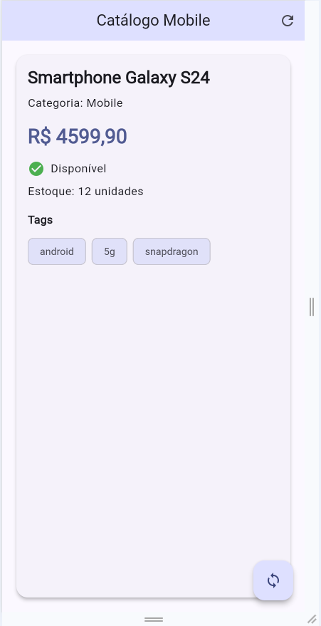

# app_catalogo_mobile

Atividade prática integrada da disciplina **Programação para Dispositivos Móveis I** (aulas 1 a 4), cursada no 4º semestre do curso de Desenvolvimento de Software Multiplataforma na FATEC Matão.

Aplicativo Flutter que simula o consumo de uma resposta JSON de um endpoint de catálogo de produtos, modela os dados em Dart aplicando conceitos de Orientação a Objetos e exibe as informações em uma interface construída com Material Design 3.

**Aluno:** Danilo
**Professor:** Diego Menegassi

---

## Objetivo

Reproduzir o ciclo de trabalho de um desenvolvedor mobile júnior:

1. Transformar uma especificação de dados (JSON) em um modelo orientado a objetos em Dart.
2. Construir uma interface ergonômica e elegante com Flutter e Material Design 3.
3. Garantir a rastreabilidade do código com controle de versão profissional usando Git e GitHub.

---

## Estrutura de dados de origem

```json
{
  "nome_produto": "Smartphone Galaxy S24",
  "categoria": "Mobile",
  "preco": 4599.90,
  "quantidade_estoque": 12,
  "disponivel": true,
  "tags": ["android", "5g", "snapdragon"]
}
```

---

## Estrutura do projeto

```
app_catalogo_mobile/
├── lib/
│   ├── main.dart              # Interface Material 3 (Scaffold + Card + Chips + FAB)
│   └── models/
│       └── produto.dart       # Modelo com tipagem estrita, getter e fromJson
├── screenshots/               # Capturas de tela do app em execução
├── pubspec.yaml
└── README.md
```

---

## Etapa 1 — Modelagem em Dart (`lib/models/produto.dart`)

- **Tipagem estrita:** cada campo do JSON mapeado para `String`, `double`, `int`, `bool` e `List<String>`.
- **Imutabilidade e null safety:** atributos declarados como `final`, construtor com parâmetros nomeados obrigatórios (`required`).
- **Regra de negócio encapsulada:** getter `temEstoqueCritico` retorna `true` quando `quantidadeEstoque` é inferior a 5.
- **Desserialização segura:** `factory Produto.fromJson(Map<String, dynamic> json)` com conversão segura de tipos numéricos (`num → double / int`).

## Etapa 2 — Interface com Material Design 3 (`lib/main.dart`)

- `useMaterial3: true` com paleta gerada por `ColorScheme.fromSeed(seedColor: Colors.indigo)`.
- `AppBar` com título centralizado e `IconButton` de recarregamento em `actions`.
- `FloatingActionButton` inferior para atualizar o catálogo.
- `Card` com elevação e espaçamento no grid de 8dp (`padding: EdgeInsets.all(16.0)`).
- Tags renderizadas como widgets `Chip`.
- Feedback visual de estoque crítico: ícone de alerta e destaque em vermelho suave quando o estoque cai abaixo de 5 unidades.
- Hot Reload usado durante o desenvolvimento para iterar sobre a UI em milissegundos.

## Etapa 3 — Versionamento com Git e GitHub

Sequência de commits semânticos aplicados no repositório:

```bash
git init
git status

git add lib/models/produto.dart
git commit -m "feat: cria modelo de dados Produto com tipagem e getters"

git add lib/main.dart
git commit -m "feat: implementa interface de catalogo com Scaffold e Cards Material 3"

git branch -M main
git remote add origin https://github.com/daniykt/app_catalogo_mobile.git
git push -u origin main
```

---

## Como executar

```bash
flutter pub get
flutter run
```

Durante a execução, pressione `r` no terminal para acionar o Hot Reload e `R` para Hot Restart.

---

## Screenshots

### Print 1 — Aplicativo em execução



---

## Tecnologias

- Flutter (SDK 3.19+)
- Dart 3
- Material Design 3
- Git / GitHub