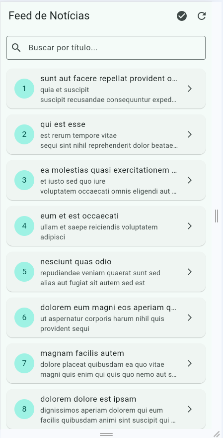
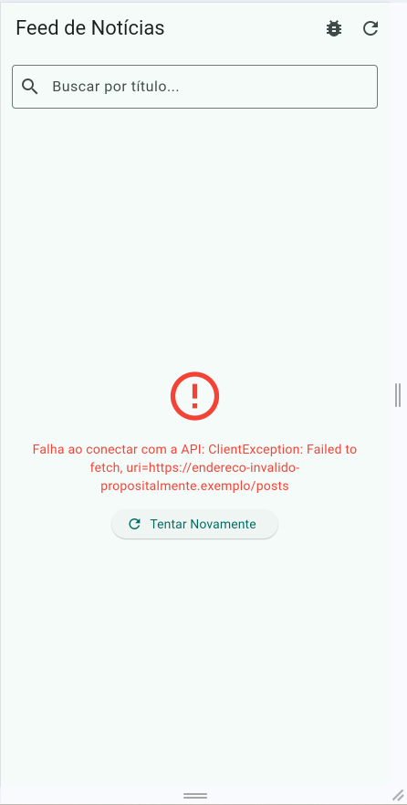
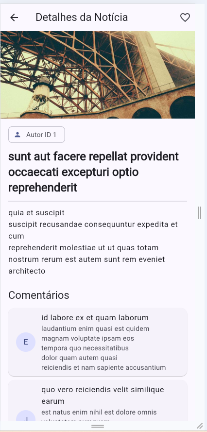
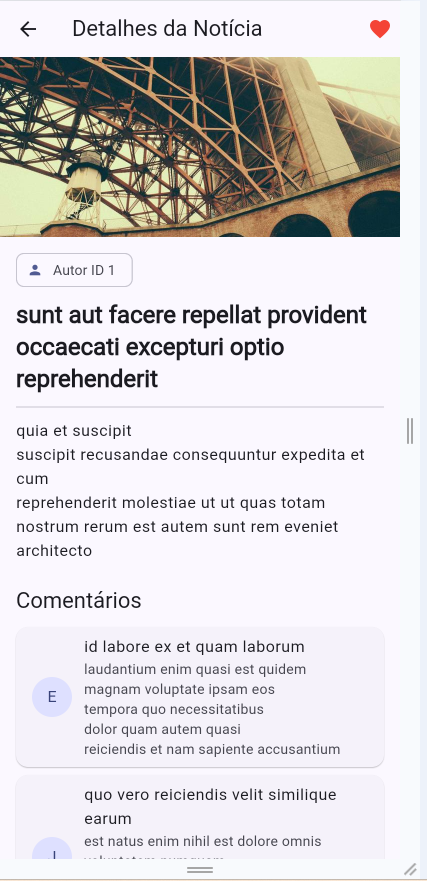
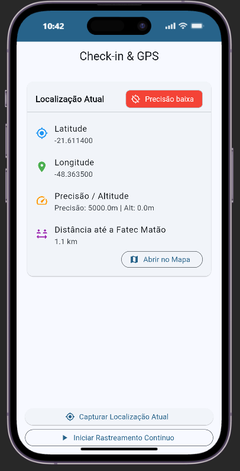
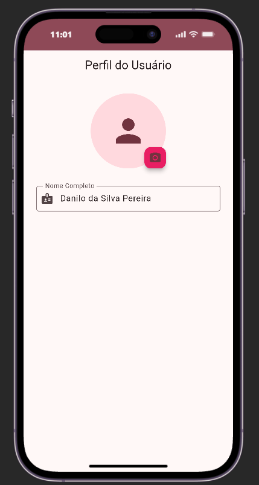
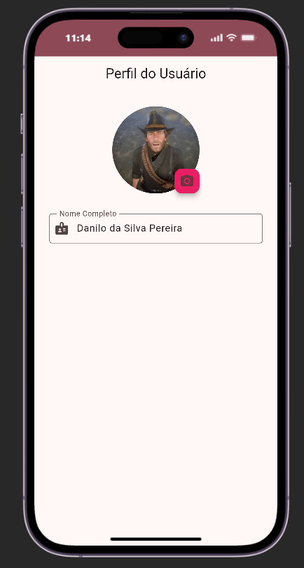

# Atividades FATEC — Programação para Dispositivos Móveis I

Repositório de atividades práticas da disciplina **Programação para Dispositivos Móveis I** (Flutter), ministrada pelo Prof. Diego Menegassi na FATEC Matão — 4º semestre de Desenvolvimento de Software Multiplataforma, 2026/2.

## Índice de atividades

| Atividade | Tema | Conceitos principais |
|-----------|------|----------------------|
| [Atividade 07](./Atividade-07) | App de Checkout e Navegação | StatefulWidget, setState, Navigator.push/pop, passagem de parâmetros |
| [Atividade 10](./Atividade-10) | Consumo de APIs, Listas e Exceções | http, jsonDecode, ListView.builder, try/catch/finally, estados de UI |
| [Atividade 11](./Atividade-11) | Fluxo Lista-Detalhe (Master-Detail) | FutureBuilder, passagem de objetos entre telas, Hero animation, segunda chamada à API |
| [Atividade 13](./Atividade-13) | Banco de dados local com SQLite | sqflite, CRUD, Singleton, toMap/fromMap |
| [Atividade 14](./Atividade-14) | Geolocalização e GPS | geolocator, permissões, stream de posição, url_launcher |
| [Atividade 15](./Atividade-15) | Câmera e galeria de mídia | image_picker, SharedPreferences, Hero, InteractiveViewer |

## Prévia das atividades

### Atividade 10 — Feed de notícias com tratamento de erro

<p align="center">
  
  
  
</p>

### Atividade 11 — Fluxo Master-Detail com Hero e comentários

<p align="center">
  
  
</p>

### Atividade 14 — Check-in com GPS

<p align="center">
  
</p>

### Atividade 15 — Perfil com câmera e galeria

<p align="center">
  
  
</p>

## Como executar qualquer atividade

```bash
cd Atividade-XX
flutter pub get
flutter run -d chrome
```

Requer Flutter SDK instalado. Testado com Flutter stable no Chrome.

A Atividade 13 (SQLite) precisa de emulador ou dispositivo Android; não roda no Chrome.
As Atividades 14 e 15 rodam no Chrome (a 15 usa bytes da imagem para funcionar na web) e também no Android.

## Autor

**Danilo da Silva Pereira** — [@daniykt](https://github.com/daniykt)
FATEC Matão · DSM · 2025–2027
